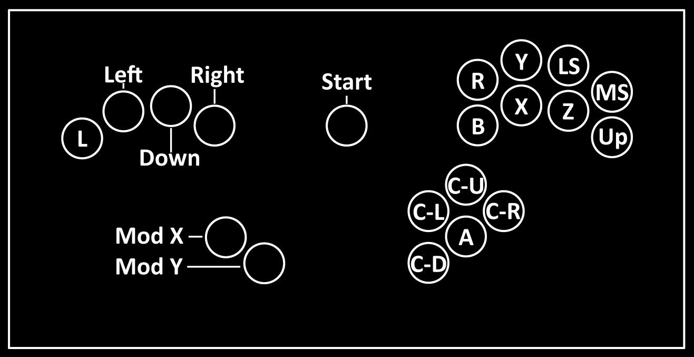
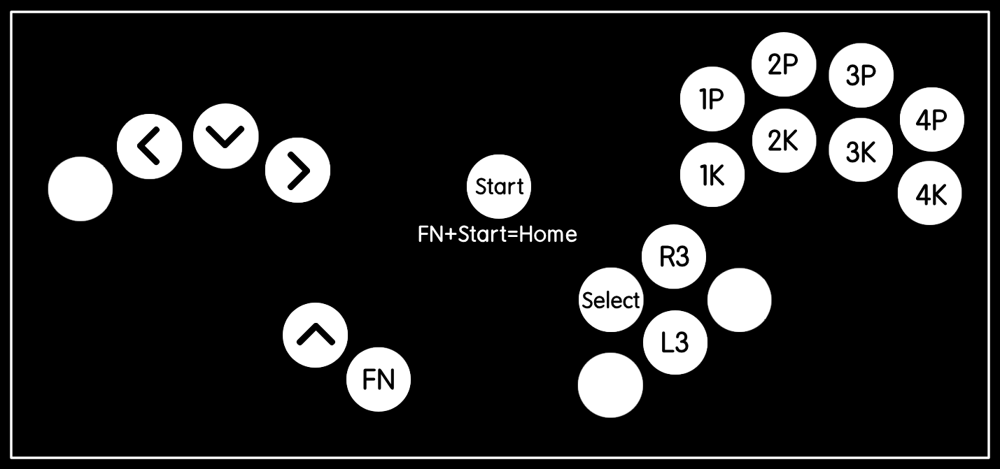
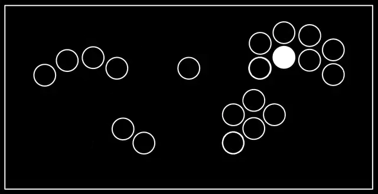
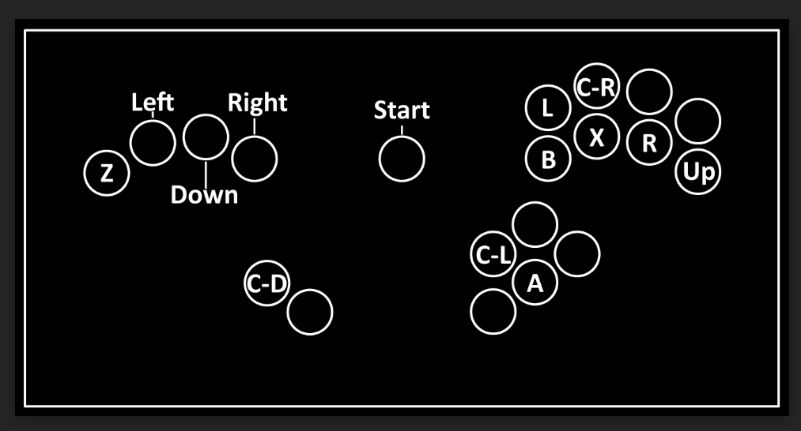

# HayBox FGC Edition

This is a modified version of HayBox, designed for [B0XX](https://b0xx.com)-style controllers. It includes a Brook Wingman compatible mode and CPT compliant SOCD in the FGC modes. This readme will cover the main differences and FAQs for our users. For more information about HayBox, please visit [the HayBox repo.](https://github.com/JonnyHaystack/HayBox)

Major changes from HayBox:

- Brook Wingman FGC mode layout, which is automatically booted into from plugin by a buttonhold
- Function key in FGC mode to prevent accidental access of the Home button
- Addition of L3 and R3 buttons in FGC mode
- Removal of double Up inputs to comply with CPT ruleset
- Tournament legal Smash 64 layout, which is automatically booted on plugin to an N64
- Options such as WASD and ATB's Peach Layout commented out in the code

## Table of Contents

- [Melee](#melee)
    - [Dolphin/Slippi Setup](#dolphinslippi-setup)
- [Project M/Project+](#project-mproject)
- [Smash Ultimate](#smash-ultimate)
- [FGC Mode](#fgc-mode)
    - [Brook Wingman](#brook-wingman)
- [Smash 64](#smash-64)
    - [Emulator Setup](#emulator-setup)
- [Customisation](#customisation)
    - [Flashing New Firmware](#flashing-new-firmware)
    - [Layouts](#layouts)
        - [ATB Peach Layout](#atb-peach-layout)
        - [WASD](#wasd)
    - [Input Modes](#input-modes)
    - [Creating Custom Input Modes](#creating-custom-input-modes)
    - [SOCD](#socd)
    - [Mod X Lightshield and R Shield Tilt](#mod-x-lightshield-and-r-shield-tilt)
    - [Mode-specific Optional Features](#mode-specific-optional-features)
        - [Melee Modes](#melee-modes)
        - [Project M/Project+ Mode](#project-mproject-mode)
- [License](#license)


## Melee



Layout for Melee mode

To switch to Melee mode when you're in any other mode, hold:
- Mod X + Start + L
  
The recommended cable for playing Melee on a GameCube or Wii is the USB-C to GameCube cable.
The recommended cable for playing Melee netplay is the USB-C to USB-A.


### Dolphin/Slippi Setup

To set up your controller to play on Slippi, download the HayBox Slippi Profile zip folder from releases on this page. Open Slippi Launcher, and click on the settings button at the top right corner of the window. Click on "Netplay", and open the settings folder. Drag and drop the unzipped HayBox Slippi Profile into that folder. Alternatively, you could copy .ini file from the dolphin folder within HayBox to the folder ```<YourDolphinInstallation>\User\Config\Profiles\GCPad\``` (create it if it does not exist). 

Once that's done, launch Dolphin. If you do not already have this set by default, go to "Game" in the Slippi launcher settings, and click on "Launch Dolphin". Close that and click the Play button on the main window of the Slippi Launcher. From Dolphin, click on "Controllers", click "Configure" for port 1 (Standard Controller), and under Profile, HayBox should be listed. Click on HayBox, load and save it. For more detailed instructions, see the original HayBox repo. 

## Project M/Project+


Layout for Project M/Project+ mode

To switch to Project M/Project+ mode, hold:
- Mod X + Left + Start

The recommended cable for playing Melee on a Wii is the USB-C to GameCube cable.
The recommended cable for playing Melee netplay is the USB-C to USB-A.

## Smash Ultimate


Smash Ultimate Layout

To switch to Smash Ultimate mode when you're in any other mode, hold:
- Mod X + Start + Down
  
For more information on using your controller in Smash Ultimate, please see this [document](https://drive.google.com/file/d/1anxAtEFysxebQPwswDVV1d1qkWk1JwKB/view).

The recommended cable for playing Smash Ultimate is to use the USB-C to GameCube cable to connect your controller to the GameCube Adapter.

## FGC Mode



FGC layout

To switch to FGC mode when you're in any other mode, hold:
- Mod X + Start + Right
  
The recommended cable for playing fighting games is the USB-C to USB-A cable.


### Brook Wingman

To use a Brook Wingman to play fighting games on a console, hold down the button highlighted below on your controller as you plug in the controller (plug the cord and Wingman into the console before plugging into your controller with the button hold).



## Smash 64


Smash 64 Layout

To switch to Smash 64 when you're in any other mode, hold: 
- Mod X + Start + X

  By default, this is the layout your controller starts with upon plugging into a Nintendo 64. The recommended cable for playing Smash 64 on console is the USB-C to N64 cable.

### Emulator Setup
The recommended cable for playing Smash 64 on PC is the USB-C to USB-A cable. You will need to manually map the controls on the emulator your first time playing. For more information, follow the guide linked [here](https://smash64.online/gamecube/).
  

## Customisation

### Flashing New Firmware

To upload new versions of firmware for your controller, hold Start on plugin to your PC. A new folder should pop up in which you can drag and drop a new firmware .uf2 file into.r3

### Layouts


#### ATB Peach Layout

There is a modified layout for Peach by ATB.

It changes the default right hand home row from B-X-Z-Up to X-Up-B-Z.
This makes DJCs and subfloats easier than the default layout while this even has the same timing as wavedashing.
Peach doesn't need to L-cancel as often as other characters (with Z) and B (for Up-Bs) is still in a comfortable position.

This is done without compromising ergonomics since it's only a rearrangement within the home row and doesn't cause you to cross rows.

#### WASD

Code for WASD directional buttons, if your controller supports it, is inside each of the modes' files. Follow the directions to uncomment WASD and comment out Up inputs accordingly.

### Input modes

To configure the button holds for input modes (controller/keyboard modes), edit
the `select_mode()` function in `config/mode_selection.hpp`. Each `if`
statement is a button combination to select an input mode.

Most input modes support passing in an SOCD cleaning mode, e.g.
`socd::2IP_NO_REAC`. See [here](#socd) for the other available modes.

### Creating custom input modes

For creating new input modes, it helps if you know some C++, or at least have
some programming experience. That said, you should be able to get by even
without prior experience if you just base your new mode off the existing ones
and refer to them as examples.

There are two types of input modes: ControllerMode and KeyboardMode

### SOCD

In the constructor of each mode (for controller modes *and* keyboard modes), you
can configure pairs of opposing direction inputs to apply SOCD cleaning to.

For example, in `src/modes/Melee20Button.cpp`:
```
_socd_pair_count = 4;
_socd_pairs = new socd::SocdPair[_socd_pair_count]{
    socd::SocdPair{&InputState::left,    &InputState::right,   socd_type},
    socd::SocdPair{ &InputState::down,   &InputState::up,      socd_type},
    socd::SocdPair{ &InputState::c_left, &InputState::c_right, socd_type},
    socd::SocdPair{ &InputState::c_down, &InputState::c_up,    socd_type},
};
```

This sets up left/right, down/up, C-Left/C-Right, and C-Down/C-Up as pairs of
opposing cardinal directions for which SOCD cleaning will be applied. The SOCD
cleaning is automatically done before `UpdateDigitalOutputs()` and
`UpdateAnalogOutputs()`, and you do not need to worry about it any further than
that.

For each `SocdPair` you can pass in an `SocdType` of your choosing. By default
for most modes this is passed in as a single constructor parameter, but it is
possible to pass in multiple parameters, or simply use a hardcoded value. Both
of these approaches are exemplified in `src/modes/FgcMode.cpp`.

| `SocdType` | Description |
| ---------- | ----------- |
| `SOCD_NEUTRAL` | Left + right = neutral - the default if no `SocdType` specified in the `SocdPair` |
| `SOCD_2IP` | Second input priority - left -> left + right = right, and vice versa. Releasing the second direction gives the original direction |
| `SOCD_2IP_NO_REAC` | Second input priority without reactivation - same as above, except releasing the second direction results in neutral. The original direction must be physically reactuated. |
| `SOCD_DIR1_PRIORITY` | The first button in the `SocdPair` always takes priority over the second |
| `SOCD_DIR2_PRIORITY` | The second button in the `SocdPair` always takes priority over the first |
| `SOCD_NONE` | No SOCD resolution - the game decides |

Note that you do not have to implement a `HandleSocd()` function like in the
Melee20Button and Melee18Button modes. It is only overridden in these modes
so that we can check if left and right are both held *before* SOCD cleaning,
because when they are both held (without a vertical direction being held) we
need to override all modifiers.

### Mod X lightshield and R shield tilt

If your controller has no lightshield buttons, you may want to use Mod X for
lightshield and put shield tilt on R instead. You can do this by using the
Melee18Button mode instead of Melee20Button.

### Mode-specific optional features

#### Melee modes

The Melee20Button and Melee18Button modes provide a choice of which coordinates to use
when pressing down + right. By default, holding down + back will allow you to do automatic
jab-cancels, which is a useful technique for some characters.

Another popular technique that uses the down + right diagonal is the so-called crouch/walk
option-select. This technique involves holding down + forward at a certain angle while
crouching, such that after crouch-cancelling an attack you will automatically start
walking towards your opponent instead of going back into crouch. This can be very useful
for tech-chasing, but the coordinates used for this technique do not allow you to auto
jab-cancel.

This can be configured as seen in `config/mode_selection.hpp` by setting the `crouch_walk_os` option to true:

```
new Melee20Button(socd::SOCD_2IP_NO_REAC, { .crouch_walk_os = false })
```

You will also have to change this in your `config/<environment>/config.cpp` in order for it to be applied on plugin, as `mode_selection.hpp` only controls what happens when you *switch* mode.

#### Project M/Project+ mode

The ProjectM mode has some extra options to configure certain behaviours. As seen
in `config/mode_selection.hpp`:

```
new ProjectM(
    socd::SOCD_2IP_NO_REAC,
    { .true_z_press = false, .ledgedash_max_jump_traj = true }
)
```

Firstly, the `ledgedash_max_jump_traj` option allows you to enable or disable the behaviour
borrowed from Melee mode where holding left and right (and no vertical directions)
will give a 1.0 cardinal regardless of modifiers being held.

If you change the SOCD mode to 2IP (with reactivation), you should also change
this option to false if you want a smooth gameplay experience.

Secondly, the `true_z_press` option exists because Project M/Project+ do not handle
Z presses the same way Melee does.
Melee interprets a Z press as lightshield + A, and thus it can be used for L
cancelling without locking you out of techs. In PM/P+, a Z press will trigger a
tech and thus cause unwanted tech lockouts if used to L cancel.
By default in HayBox, the ProjectM mode is set to use a macro of lightshield + A
in order to preserve expected behaviour from Melee. However, this macro does not
enable you to use tether/grapple attacks or grab items. To workaround this, you
can press Mod X + Z to send a true Z input.

If this bothers you, and you just want to send a true Z input by default when
pressing Z, you can set the `true_z_press` option to true.

## License

This project is licensed under the GNU GPL Version 3 - see the [LICENSE](LICENSE) file for details
